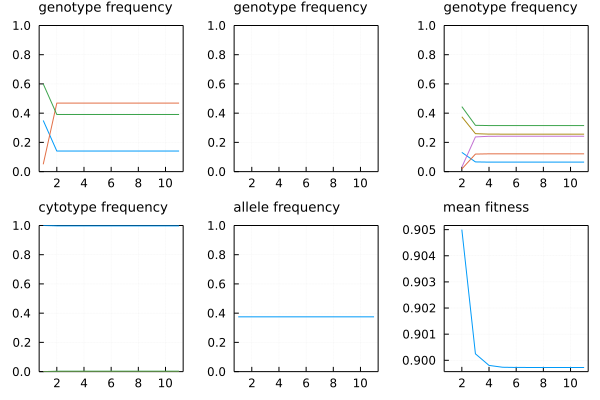
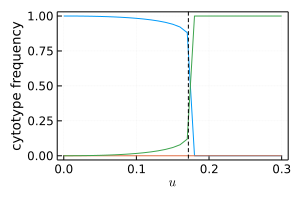
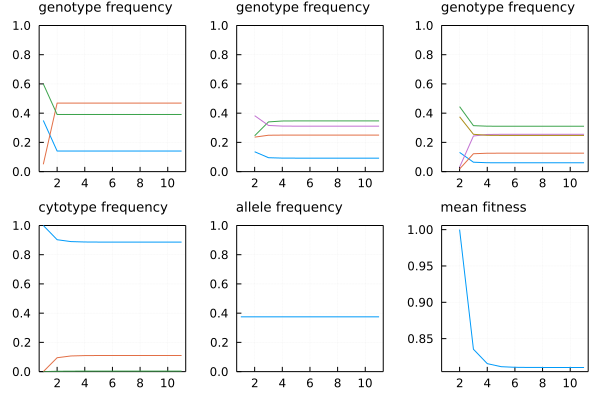
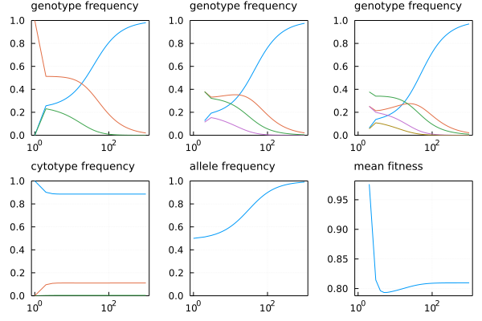

# Mixed ploidy deterministic system with selection

Arthur Zwaenepoel -- 2022

Here I implement some code to simulate a deterministic mixed-ploidy
single-locus system (discrete generations). The system may consist of
diploids, triploids and tetraploids, and allows for arbitrary single-locus
selection schemes.

## Single deme
Here I implement the dynamics for a single panmictic deme.  Eventually, the
goal is to connect multiple demes by migration (see below), but we first
consider the dynamics within one such panmictic unit.

First let's load some packages

````julia
using Printf, Plots, Literate
default(framestyle=:box, gridstyle=:dot, guidefont=9, titlefont=9, title_loc=:left)
````

This file can be compiled to markdown using `Literate.markdown(...)`.

Node within a Deme, represents a single subpopulation of a particular fixed
cytotype.

````julia
struct Node{T}
    ploidy    :: Int
    viability :: Vector{T}  # genotype fitnesses
    fertility :: Vector{T}  # frequency of haploid and diploid gametes produced
    genotypes :: Vector{T}  # the frequencies for the five possible gametes
end
````

Make a new node from an old one but with a different genetic constitution `g`

````julia
update_node(n::Node, g) = Node(n.ploidy, n.viability, n.fertility, g)
````

````
update_node (generic function with 1 method)
````

Note that the sum of the `fertility` vector gives the fertility of an
individual in that node, hence the name.

Here's an example of a node:

````julia
node_diploid  = Node(2, ones(3), [0.95, 0.05], [0.35, 0.05, 0.6])
````

````
Main.var"##619".Node{Float64}(2, [1.0, 1.0, 1.0], [0.95, 0.05], [0.35, 0.05, 0.6])
````

This represents a diploid subpopulation, where all three genotypes have equal
fitness (`ones(3) == [1, 1, 1]`), where each gamete is haploid with probabili
0.95 and diploid else, and where the initial genotype frequencies are 0.35,
0.05 and 0.6 for genotypes `00`, `01`, and `11` respectively.

A deme is a panmictic unit, i.e. all nodes contribute gamete to one gamete
pool according to their respective proportion in the deme and gamete
production table.

````julia
struct Deme{T}
    nodes       :: Vector{Node{T}}
    proportions :: Vector{T}
    meanfitness :: T
end
````

Constructor for if we don't know mean fitness...

````julia
Deme(n, p) = Deme(n, p, NaN)
````

````
Main.var"##619".Deme
````

Function to compute the allele frequency (for the `0` allele) in a deme

````julia
function allele_frequency(deme::Deme)
    f = 0.
    for (n, p) in zip(deme.nodes, deme.proportions)
        p == 0. && continue  # NaN issues
        f += p * allele_frequency(Val(n.ploidy), n.genotypes)
    end
    return f
end
````

````
allele_frequency (generic function with 1 method)
````

Functions to compute the allele frequencies for each cytotype

````julia
allele_frequency(::Val{2}, x) = x[1] + x[2]/2
allele_frequency(::Val{3}, x) = x[1] + 2*x[2]/3 + x[3]/3
allele_frequency(::Val{4}, x) = x[1] + 3*x[2]/4 + x[3]/2 + x[4]/4
````

````
allele_frequency (generic function with 4 methods)
````

A function to nicely print out a deme to the terminal

````julia
function Base.show(io::IO, d::Deme)
    write(io, @sprintf("Deme, allele frequency = %.4f", allele_frequency(d)), "\n")
    for (n, p) in zip(d.nodes, d.proportions)
        write(io, @sprintf("Node (ploidy=%d) %.2f, genotypes: ", n.ploidy, p))
        write(io, join([@sprintf("%.4f", g) for g in n.genotypes], ", "), "\n")
    end
end
````

For a given genotype vector, the following functions return the produced
gametes, **conditional** on the ploidy level of the gamete.
Note that there are five possible gametes in the system, if we label the
alleles 0 and 1, they are the following genotypes: [0, 1, 00, 10, 11]. For
each cytotype, we define for each genotype a matrix with the proportion of
these gametes that are produced, conditional on a gamete of that cytotype
being produced. Note that we assume no double reduction and make rather ad
hoc assumptions on the unreduced gametes produced by 01 heterozygotes.

````julia
function gametes(::Val{2}, x)
    # diploids
    #      0   1  00  01  11
    G = [1.0 0.0 1.0 0.0 0.0;  # 00
         1/2 1/2 1/4 1/2 1/4;  # 01
         0.0 1.0 0.0 0.0 1.0]  # 11
    return vec(x' * G)
end

function gametes(::Val{3}, x)
    # triploids
    #      0   1  00  01  00
    G = [1.0 0.0 1.0 0.0 0.0;  # 000
         2/3 1/3 1/3 2/3 0.0;  # 001
         1/3 2/3 0.0 2/3 1/3;  # 011
         0.0 1.0 0.0 0.0 1.0]  # 111
    return vec(x' * G)
end

function gametes(::Val{4}, x)
    # tetraploids
    #     0    1  00  01  11
    G = [1.0 0.0 1.0 0.0 0.0;  # 0000
         3/4 1/4 1/2 1/2 0.0;  # 0001
         1/2 1/2 1/6 1/3 1/6;  # 0011
         1/4 3/4 0.0 1/2 1/2;  # 0111
         0.0 1.0 0.0 0.0 1.0]  # 1111
    # Note there are no known mechanisms for generating haploid gametes from
    # tetraploid genotypes, but for copleteness I filled the matrix anyhow...
    return vec(x' * G)
end
````

````
gametes (generic function with 3 methods)
````

Produce the gamete pool at a given node (not yet weighted by the proportion
of this node in the population!)

````julia
function gametes(node::Node)
    u1, u2 = node.fertility  # proportion haploid/diploid gametes
    g = gametes(Val(node.ploidy), node.genotypes) .* [u1, u1, u2, u2, u2]
    return g
end
````

````
gametes (generic function with 4 methods)
````

This function obtains the genotype frequencies after random union of gamates
(as represented by the `Z` matrix).
See below for explanation of the zygote matrix `Z`

````julia
_genotypes(::Val{2}, Z) = [Z[1,1], 2Z[1,2], Z[2,2]]                                # 00 01 11
_genotypes(::Val{3}, Z) = [Z[1,3], Z[1,4] + Z[2,3], Z[1,5] + Z[2,4], Z[2,5]] .* 2  # 000 001 011 111
_genotypes(::Val{4}, Z) = [Z[3,3], 2Z[3,4], 2Z[3,5] + Z[4,4], 2Z[4,5], Z[5,5]]     # 0000 0001 0011 0111 1111
````

````
_genotypes (generic function with 3 methods)
````

Get the genotype frequencies

````julia
get_genotypes(n::Node, Z) = _genotypes(Val(n.ploidy), Z)
````

````
get_genotypes (generic function with 1 method)
````

Normalization function

````julia
normalize(x) = x ./ sum(x)
````

````
normalize (generic function with 1 method)
````

Get a gemate pool for a deme (see below)

````julia
function get_gametepool(deme::Deme{T}) where T
    gamete_pool = zeros(T, 5)
    for (node, p) in zip(deme.nodes, deme.proportions)
        p == 0. && continue  # NaN issues
        gamete_pool .+= p .* gametes(node)
    end
    return gamete_pool
end
````

````
get_gametepool (generic function with 1 method)
````

Now we can define the map of the dynamical system for a single deme
(panmictic unit)

````julia
function generation(deme::Deme{T}) where T
    # 1. Collect all the gametes
    gamete_pool = get_gametepool(deme)
    # 2. Do random mating of this pool
    Z = gamete_pool * gamete_pool'
    # 3. Apply selection and get the new genotype/cytotype frequencies
    p_ = zeros(T, length(deme.proportions))
    n_ = similar(deme.nodes)
    for (i, n) in enumerate(deme.nodes)
        gt = get_genotypes(n, Z)
        gt .*= n.viability   # applies selection
        p_[i] = sum(gt)
        n_[i] = update_node(n, normalize(gt))
    end
    deme = Deme(n_, normalize(p_), sum(p_))
end
````

````
generation (generic function with 1 method)
````

Here `Z`(ygotes) is a matrix of zygotes with following genotypes (note that
it is symmetric of course):

|     |    0 |     1 |    00  |   01  |   11 |
| ----|------|-------|--------|-------|------|
|   0 |   00 |    01 |   000  |  001  |  011 |
|   1 |   10 |    11 |   100  |  101  |  111 |
|  00 |  000 |   001 |  0000  | 0001  | 0011 |
|  01 |  010 |   011 |  0100  | 0101  | 0111 |
|  11 |  110 |   111 |  1100  | 1101  | 1111 |

You get it by multiplying a vector of gametes (rows/columns) with itself.
Take this example deme:

````julia
node_diploid  = Node(2, ones(3), [0.95, 0.05], [0.35, 0.05, 0.6])
node_triploid = Node(3, ones(4), [0.05, 0.05], [0.5, 0.25, 0., 0.25])
node_tetploid = Node(4, ones(5), [0.0,  1.00], [1. , 0. , 0., 0., 0.])
deme = Deme([node_diploid, node_triploid, node_tetploid], [0.9, 0.05, 0.05])
````

````
Deme, allele frequency = 0.4208
Node (ploidy=2) 0.90, genotypes: 0.3500, 0.0500, 0.6000
Node (ploidy=3) 0.05, genotypes: 0.5000, 0.2500, 0.0000, 0.2500
Node (ploidy=4) 0.05, genotypes: 1.0000, 0.0000, 0.0000, 0.0000, 0.0000

````

This is the gamete pool (frequencies of `0, 1, 00, 01, 11` in that order):

````julia
G = get_gametepool(deme)
````

````
5-element Vector{Float64}:
 0.32229166666666664
 0.5352083333333334
 0.06777083333333334
 0.001541666666666667
 0.0281875
````

All possible gamete combinations are then represented in this matrix:

````julia
Z = G * G'
````

````
5×5 Matrix{Float64}:
 0.103872     0.172493     0.021842    0.000496866  0.0090846
 0.172493     0.286448     0.0362715   0.000825113  0.0150862
 0.021842     0.0362715    0.00459289  0.00010448   0.00191029
 0.000496866  0.000825113  0.00010448  2.37674e-6   4.34557e-5
 0.0090846    0.0150862    0.00191029  4.34557e-5   0.000794535
````

Here's a function to iterate a discrete dynamical system

````julia
function iterate_map(f, x0, n)
    xs = [x0]
    for i=1:n
        push!(xs, f(xs[end]))
    end
    return xs
end
````

````
iterate_map (generic function with 1 method)
````

... and one to plot the results

````julia
function plot_sim(xs; kwargs...)
    genotypes = map(1:length(xs[1].nodes)) do i
        hcat([x.nodes[i].genotypes for x in xs]...) |> permutedims
    end
    cs = hcat(getfield.(xs, :proportions)...) |> permutedims
    af = allele_frequency.(xs)
    mw = getfield.(xs, :meanfitness)
    plot(plot.(genotypes, title="genotype frequency", ylim=(0,1))...,
         plot(cs, title="cytotype frequency", ylim=(0,1)),
         plot(af, title="allele frequency", ylim=(0,1)),
         plot(mw, title="mean fitness"); legend=false,
         kwargs...)
end
````

````
plot_sim (generic function with 1 method)
````

Let us set up some deme which departs strongly from Hardy-Weinberg
equilibrium, has inviable triploids, and starts with 100% diploids:

````julia
node_diploid  = Node(2, ones(3),  [0.95, 0.05], [0.35, 0.05, 0.60])
node_triploid = Node(3, zeros(4), [0.00, 0.00], fill(NaN, 4))
node_tetploid = Node(4, ones(5),  [0.00, 1.00], fill(NaN, 5))
deme = Deme([node_diploid, node_triploid, node_tetploid], [1.0, 0.0, 0.0])
````

````
Deme, allele frequency = 0.3750
Node (ploidy=2) 1.00, genotypes: 0.3500, 0.0500, 0.6000
Node (ploidy=3) 0.00, genotypes: NaN, NaN, NaN, NaN
Node (ploidy=4) 0.00, genotypes: NaN, NaN, NaN, NaN, NaN

````

Let's evolve the system, we'd expect it to get to an equilibrium distribution
of cytotypes and genotypes within cytotypes rather quickly:

````julia
xs = iterate_map(generation, deme, 10)
plot_sim(xs)
````


Indeed we do reach equilibrium very quickly, but not in a single generation
(as would be in the case of a pure diploid population).
The allele frequency remains constant as expected.

The critical unreduced gamete formation rate should be about 0.17, let's
check that:

````julia
function test_crit_fun(u)
    node_diploid  = Node(2, ones(3),  [ 1-u,    u], [1.0, 0.0, 0.0])
    node_triploid = Node(3, zeros(4), [0.00, 0.00], fill(NaN, 4))
    node_tetploid = Node(4, ones(5),  [0.00, 1.00], fill(NaN, 5))
    deme = Deme([node_diploid, node_triploid, node_tetploid], [1.0, 0.0, 0.0])
    xs = iterate_map(generation, deme, 5000)
    last(xs).proportions
end
plot(0:0.01:0.3, hcat(map(test_crit_fun, 0:0.01:0.3)...) |> permutedims)
vline!([1/(2√2+3)], legend=false)
````


Now still without selection but also with triploids, again starting from 100%
diploids.

````julia
node_diploid  = Node(2, ones(3), [0.95, 0.05], [0.35, 0.05, 0.6])
node_triploid = Node(3, ones(4), [0.05, 0.05], fill(NaN, 4))
node_tetploid = Node(4, ones(5), [0.00, 0.95], fill(NaN, 5))
deme = Deme([node_diploid, node_triploid, node_tetploid], [1.0, 0.0, 0.0])
xs = iterate_map(generation, deme, 10)
plot_sim(xs)
````


For some reason I don't understand the allele frequency changes in this model
until it reaches 0%... Not sure if a bug or a property about the mixed ploidy
system I don't get.

````julia
xs = iterate_map(generation, deme, 10000)
plot_sim(xs, xscale=:log10)
````


I would expect this doesn't happen when we start off with p=0.5.

````julia
node_diploid  = Node(2, ones(3), [0.95, 0.05], [0.0, 1.0, 0.0])
node_triploid = Node(3, ones(4), [0.05, 0.05], fill(NaN, 4))
node_tetploid = Node(4, ones(5), [0.00, 0.95], fill(NaN, 5))
deme = Deme([node_diploid, node_triploid, node_tetploid], [1.0, 0.0, 0.0])
xs = iterate_map(generation, deme, 10000)
plot_sim(xs, xscale=:log10)
````


Indeed, note BTW that tetraploids are *not* in HW proportions! $0.5^4 =
0.0625 \ne 0.1318$!

Note that fitnesses can be genotype/cytotype specific in the above
implementation. Consider this example where we have a completely recessive
deleterious allele, so that all 1 homozygotes have fitness 1-s, whereas all
other genotypes have relative fitness 1.

````julia
s = 0.1
node_diploid  = Node(2, [1., 1., 1-s],         [0.95, 0.05], [0.0, 1.0, 0.0])
node_triploid = Node(3, [1., 1., 1., 1-s],     [0.05, 0.05], fill(NaN, 4))
node_tetploid = Node(4, [1., 1., 1., 1., 1-s], [0.00, 0.95], fill(NaN, 5))
deme = Deme([node_diploid, node_triploid, node_tetploid], [1.0, 0.0, 0.0])
xs = iterate_map(generation, deme, 1000)
plot_sim(xs, xscale=:log10)
````


## Two deme habitat

Now we introduce migration. We are primarily interested in the case with two
demes undergoing largely independent evolution but with migration at the
tetraploid level. We assume the following life cycle: `gamete generation ->
syngamy -> selection -> migration`. Let us assume symmetric bidirectional
migration.

````julia
struct TwoDemeHabitat{T}
    m  :: Vector{T}  # migration rates for the three cytotypes
    d1 :: Deme{T}
    d2 :: Deme{T}
end

function generation(hab::TwoDemeHabitat) where T
    d1 = generation(hab.d1)
    d2 = generation(hab.d2)
    for (k, mk) in enumerate(hab.m)
        g1 = copy(d1.nodes[k].genotypes)  # copy!
        g2 = copy(d2.nodes[k].genotypes)
        d1.nodes[k].genotypes .= (1 - mk) * g1 .+ mk * g2
        d2.nodes[k].genotypes .= (1 - mk) * g2 .+ mk * g1
    end
    TwoDemeHabitat(hab.m, d1, d2)
end

function plot_sim(xs::Vector{<:TwoDemeHabitat}; kwargs...)
    p1 = plot_sim(map(x->x.d1, xs); kwargs...)
    p2 = plot_sim(map(x->x.d2, xs); kwargs...)
    plot(p1, p2, layout=(2,1), size=(600,600))
end
````

````
plot_sim (generic function with 2 methods)
````

We construct an example in which one allele is a deleterious recessive in
deme 1, whereas the other is deleterious recessive in the other. Whereas in
the single-deme case we would get eventual fixation of the beneficial allele,
here we expect a migration-selection equilibrium.

````julia
s = 0.1
node_diploid  = Node(2, [1., 1., 1-s],         [0.95, 0.05], [1.0, 0.0, 0.0])
node_triploid = Node(3, [1., 1., 1., 1-s],     [0.05, 0.05], fill(NaN, 4))
node_tetploid = Node(4, [1., 1., 1., 1., 1-s], [0.00, 0.95], fill(NaN, 5))
deme1 = Deme([node_diploid, node_triploid, node_tetploid], [1.0, 0.0, 0.0])

node_diploid  = Node(2, [1-s, 1., 1.],         [0.95, 0.05], [0.0, 0.0, 1.0])
node_triploid = Node(3, [1-s, 1., 1., 1.],     [0.05, 0.05], fill(NaN, 4))
node_tetploid = Node(4, [1-s, 1., 1., 1., 1.], [0.00, 0.95], fill(NaN, 5))
deme2 = Deme([node_diploid, node_triploid, node_tetploid], [1.0, 0.0, 0.0])
````

````
Deme, allele frequency = 0.0000
Node (ploidy=2) 1.00, genotypes: 0.0000, 0.0000, 1.0000
Node (ploidy=3) 0.00, genotypes: NaN, NaN, NaN, NaN
Node (ploidy=4) 0.00, genotypes: NaN, NaN, NaN, NaN, NaN

````

Note that we initialize the demes as fixed for the locally benefecial allele.
We assume complete mixing at the tetraploid level, and no migration in the
other cytotypes.

````julia
hab = TwoDemeHabitat([0., 0., 0.5], deme1, deme2)
````

````
Main.var"##619".TwoDemeHabitat{Float64}([0.0, 0.0, 0.5], Deme, allele frequency = 1.0000
Node (ploidy=2) 1.00, genotypes: 1.0000, 0.0000, 0.0000
Node (ploidy=3) 0.00, genotypes: NaN, NaN, NaN, NaN
Node (ploidy=4) 0.00, genotypes: NaN, NaN, NaN, NaN, NaN
, Deme, allele frequency = 0.0000
Node (ploidy=2) 1.00, genotypes: 0.0000, 0.0000, 1.0000
Node (ploidy=3) 0.00, genotypes: NaN, NaN, NaN, NaN
Node (ploidy=4) 0.00, genotypes: NaN, NaN, NaN, NaN, NaN
)
````

We find the equilibrium numerically:

````julia
xs = iterate_map(generation, hab, 10000)
plot_sim(xs, xscale=:log10)
````


The equilibrium allele frequency of the deleterious allele is about 4%.

````julia
xs[end]
````

````
Main.var"##619".TwoDemeHabitat{Float64}([0.0, 0.0, 0.5], Deme, allele frequency = 0.9595
Node (ploidy=2) 0.89, genotypes: 0.9278, 0.0709, 0.0012
Node (ploidy=3) 0.11, genotypes: 0.8787, 0.0743, 0.0455, 0.0015
Node (ploidy=4) 0.00, genotypes: 0.4170, 0.0405, 0.0851, 0.0405, 0.4170
, Deme, allele frequency = 0.0405
Node (ploidy=2) 0.89, genotypes: 0.0012, 0.0709, 0.9278
Node (ploidy=3) 0.11, genotypes: 0.0015, 0.0455, 0.0743, 0.8787
Node (ploidy=4) 0.00, genotypes: 0.4170, 0.0405, 0.0851, 0.0405, 0.4170
)
````

We could compute such equilibria for many local adaptation scenarios,
polyploid fitnesses, fertilities, migration rates, etc. We could also
consider other aspects of polyploid genetics currently ignored, such as
double reduction, and the different ways of generating unreduced gametes
(first division restitution, second division restitution, ...).

<a rel="license" href="http://creativecommons.org/licenses/by-sa/4.0/"></a><br />This work is licensed under a <a rel="license" href="http://creativecommons.org/licenses/by-sa/4.0/">Creative Commons Attribution-ShareAlike 4.0 International License</a>.

---

*This page was generated using [Literate.jl](https://github.com/fredrikekre/Literate.jl).*

